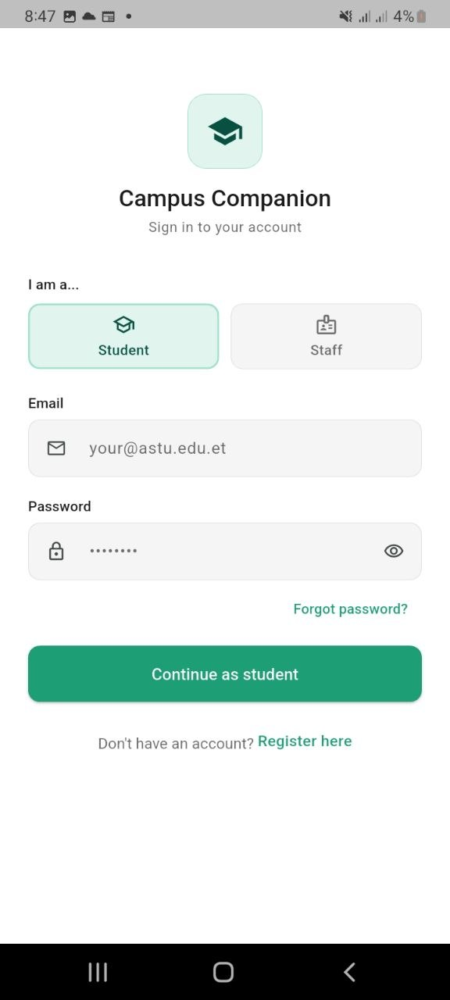
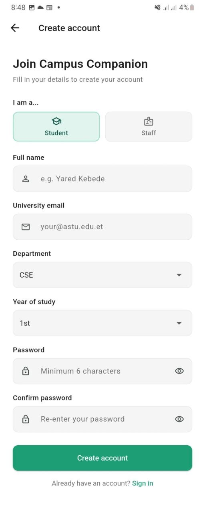
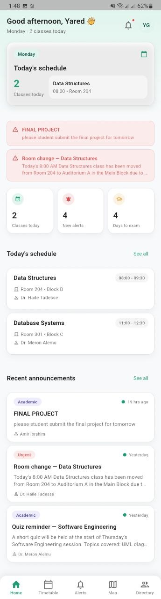
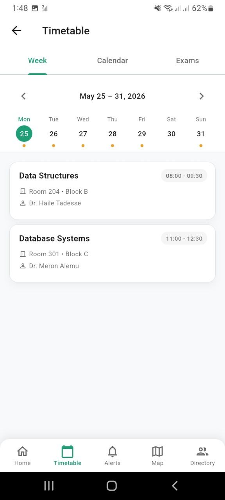
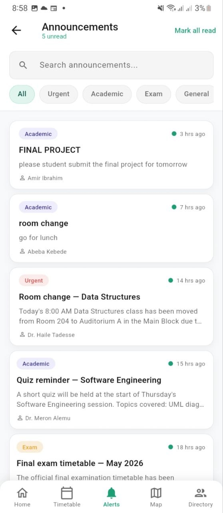
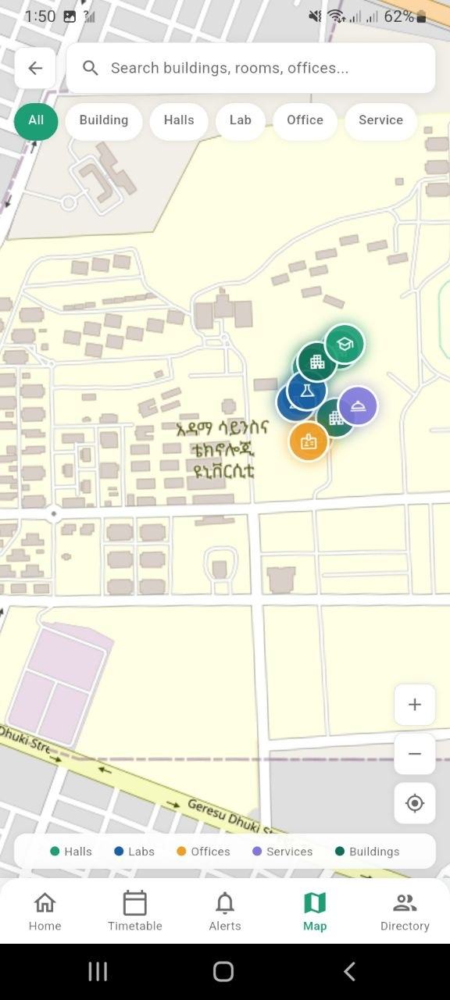
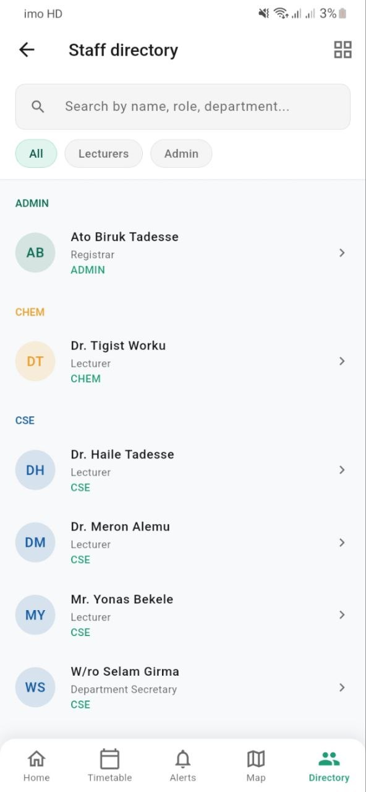
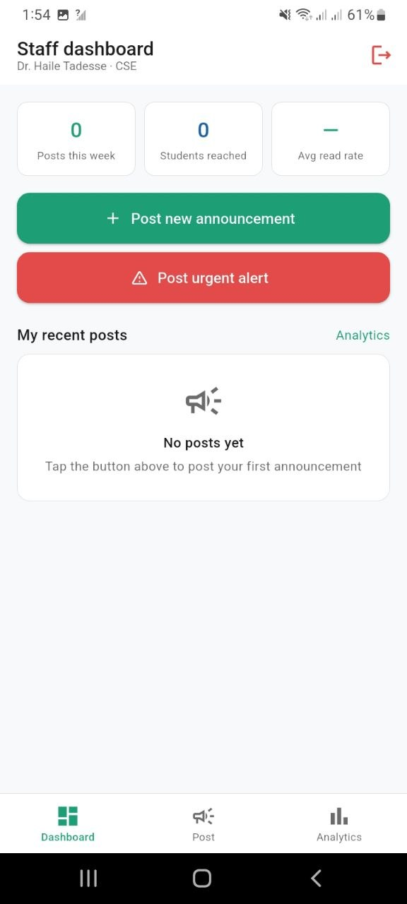
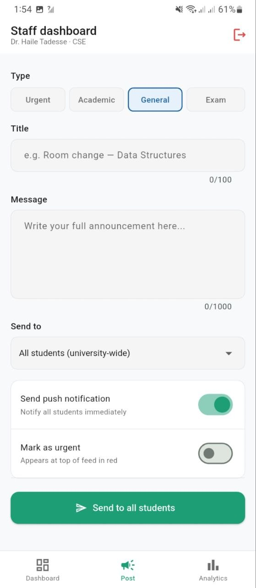
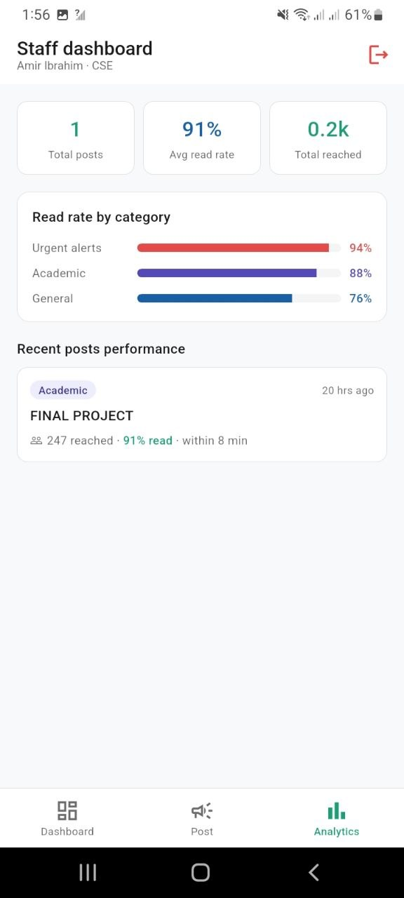

<div align="center">


# 🎓 Smart Campus Companion


**A Flutter mobile application that replaces fragmented Telgram chains with one official campus information system for ASTU students and staff.** 

[](https://flutter.dev)
[](https://firebase.google.com)
[](https://flutter.dev)
[](LICENSE)

> 📱 **[Download latest APK](https://github.com/Abukiya/smart-campus-companion/releases/latest/download/CampusCompanion_v1.0.0.apk)** — Android 5.0+

</div>

---

## 📋 Table of Contents

- [About the Project](#about-the-project)
- [Research Background](#research-background)
- [App Screenshots](#app-screenshots)
- [Features](#features)
- [Tech Stack](#tech-stack)
- [Project Structure](#project-structure)
- [Getting Started](#getting-started)
- [Firebase Setup](#firebase-setup)
- [Demo Accounts](#demo-accounts)
- [Seeding Test Data](#seeding-test-data)
- [Running Tests](#running-tests)
- [Deliverables](#deliverables)
- [Firestore Collections](#firestore-collections)
- [Innovation Features](#innovation-features)
- [Team](#team)

---

## About the Project

**Smart Campus Companion** is a mobile application built for **Adama Science and Technology University (ASTU)** as part of the Multi-Platform Software Development for Real-World Problems (CSE) final project.

The app solves a documented, research-backed problem: **90% of ASTU students have missed a class, quiz, or exam due to information failures** in the current campus communication system — which relies entirely on class representatives forwarding messages through Telegram groups.

---

## Research Background

The project began with a deep study phase conducted during the final examination period. An online survey was distributed via Telegram to avoid disrupting students.

| Metric | Result |
|--------|--------|
| Total survey respondents | 13 (10 students + 3 staff) |
| Students affected by info failures | **90%** |
| Students using the official university portal | **0%** |
| Average ease of finding offices (1–5) | **2.3 / 5** |
| Staff willing to use an admin dashboard | **100%** |

**Five key pain points identified:**
1. No centralized information source — students rely on fragmented Telegram groups
2. Class representative as single point of failure — 9/10 students depend on one person
3. No real-time alerts — room changes discovered only upon arrival at wrong room
4. Inaccessible staff contact information — *"we cannot get the phone numbers"*
5. Serious real-world consequences — documented Grade F from missed exam information

---

## App Screenshots

### 🔐 Authentication

<div align="center">
<table>
  <tr>
    <td align="center">
      
      <br/><b>Login</b>
      <br/><sub>Role selector + email/password</sub>
    </td>
    <td align="center">
      
      <br/><b>Register</b>
      <br/><sub>Create student or staff account</sub>
    </td>
  </tr>
</table>
</div>

### 👨‍🎓 Student Screens

<div align="center">
<table>
  <tr>
    <td align="center">
      
      <br/><b>Dashboard</b>
      <br/><sub>Schedule, alerts & announcements</sub>
    </td>
    <td align="center">
      
      <br/><b>Timetable</b>
      <br/><sub>Weekly view with class cards</sub>
    </td>
    <td align="center">
      
      <br/><b>Announcements</b>
      <br/><sub>Real-time feed with filters</sub>
    </td>
  </tr>
  <tr>
    <td align="center">
      
      <br/><b>Campus Map</b>
      <br/><sub>Real ASTU map via OpenStreetMap</sub>
    </td>
    <td align="center">
      
      <br/><b>Staff Directory</b>
      <br/><sub>Contact info grouped by department</sub>
    </td>
  </tr>
</table>
</div>

### 👨‍💼 Staff Screens

<div align="center">
<table>
  <tr>
    <td align="center">
      
      <br/><b>Staff Dashboard</b>
      <br/><sub>Posts, reach & action buttons</sub>
    </td>
    <td align="center">
      
      <br/><b>Post Announcement</b>
      <br/><sub>Send to department or university-wide</sub>
    </td>
    <td align="center">
      
      <br/><b>Analytics</b>
      <br/><sub>Read rates & delivery stats</sub>
    </td>
  </tr>
</table>
</div>

---

## Features

### 👨‍🎓 Student Features

| Feature | Description |
|---------|-------------|
| **Smart Dashboard** | Today's schedule, unread alert count, days to exam, urgent banners, recent announcements |
| **Timetable** | Weekly view, academic calendar, and exam schedule with countdowns |
| **Announcements** | Real-time feed with search, category filters (Urgent / Academic / Exam / General), unread tracking |
| **Campus Map** | Interactive OpenStreetMap locked to ASTU campus with color-coded building markers and search |
| **Staff Directory** | Contact info, office hours, office location, and courses for all staff — grouped by department |
| **Offline Mode** | Last-synced timetable and announcements available without internet (Hive cache) |
| **Push Notifications** | Instant alerts for room changes, cancellations, and announcements via FCM |

### 👨‍💼 Staff Features

| Feature | Description |
|---------|-------------|
| **Staff Dashboard** | Posts this week, students reached, read rate, and recent post management |
| **Post Announcement** | Send urgent alerts or general announcements in under 3 steps — department or university-wide |
| **Analytics** | Read rates by category (Urgent 94% / Academic 88% / General 76%), delivery counts, time-to-read |
| **Manage Posts** | Edit or delete existing announcements with confirmation dialog |

---

## Tech Stack

| Layer | Technology |
|-------|-----------|
| Mobile framework | Flutter 3.41.6 (Dart 3.11.4) |
| Authentication | Firebase Authentication (Email/Password) |
| Database | Cloud Firestore (real-time) |
| Push notifications | Firebase Cloud Messaging (FCM) |
| Offline cache | Hive + Hive Flutter |
| Maps | flutter_map + OpenStreetMap (no API key required) |
| State management | Provider |
| Navigation | Go Router |
| Image loading | Cached Network Image |
| Platform | Android (primary) · iOS compatible |

---

## Project Structure

```
lib/
├── main.dart                           # App entry point — Firebase + Hive init
├── firebase_options.dart               # Generated by FlutterFire CLI
│
├── core/
│   ├── constants/
│   │   ├── app_colors.dart             # Color palette
│   │   └── app_strings.dart            # All UI text strings
│   └── theme/
│       └── app_theme.dart              # ThemeData configuration
│
├── models/
│   ├── user_model.dart                 # Student and staff user model
│   ├── schedule_model.dart             # Class schedule model
│   ├── announcement_model.dart         # Announcement model
│   ├── staff_model.dart                # Staff directory model
│   └── location_model.dart             # Campus location model
│
├── services/
│   ├── auth_service.dart               # Firebase Auth — login, register, logout
│   ├── firestore_service.dart          # All Firestore reads and writes
│   ├── cache_service.dart              # Hive offline caching
│   ├── notification_service.dart       # FCM push notification setup
│   └── data_seeder.dart                # Dev only — seeds all test data in one tap
│
├── features/
│   ├── auth/
│   │   ├── login_screen.dart           # Role selector + login form
│   │   ├── register_screen.dart        # New user registration
│   │   └── onboarding_screen.dart      # First-time 3-slide tour
│   ├── dashboard/
│   │   └── dashboard_screen.dart       # Student home screen (3 states)
│   ├── timetable/
│   │   └── timetable_screen.dart       # Week / Calendar / Exams tabs
│   ├── announcements/
│   │   └── announcements_screen.dart   # Feed + search + filters + detail
│   ├── map/
│   │   └── map_screen.dart             # OpenStreetMap + markers + search
│   ├── directory/
│   │   └── directory_screen.dart       # Staff list + profiles + dept view
│   └── admin/
│       ├── admin_dashboard_screen.dart  # Staff home with analytics
│       └── post_announcement_screen.dart # Post / edit announcements
│
└── widgets/
    ├── class_card.dart                 # Reusable schedule card (active / cancelled / room changed)
    ├── announcement_card.dart          # Reusable announcement card with unread state
    └── bottom_nav.dart                 # Shared student bottom navigation

test/
├── unit_test.dart                      # 20 unit tests (models)
└── widget_test.dart                    # 12 widget integration tests
```

---

## Getting Started

### Prerequisites

- Flutter 3.41.6 or later
- Dart 3.11.4 or later
- Android Studio or VS Code with Flutter extension
- Firebase account (free tier)
- Git

### Installation

**1. Clone the repository**
```bash
git clone https://github.com/your-username/campus_companion.git
cd campus_companion
```

**2. Install dependencies**
```bash
flutter pub get
```

**3. Create asset folders**
```bash
mkdir -p assets/images assets/icons docs/screenshots
```

**4. Set up Firebase** (see [Firebase Setup](#firebase-setup) below)

**5. Run the app**
```bash
flutter run
```

---

## Firebase Setup

**1. Create a Firebase project**

Go to [console.firebase.google.com](https://console.firebase.google.com) → Add project → name it `campus-companion-astu`.

**2. Enable services**

- **Authentication** → Sign-in method → Email/Password → Enable
- **Firestore Database** → Create database → Start in test mode → Region: europe-west1
- **Cloud Messaging** → Enabled by default

**3. Connect Flutter to Firebase**

```bash
# Install Firebase CLI
npm install -g firebase-tools
firebase login

# Install FlutterFire CLI
dart pub global activate flutterfire_cli

# Connect your project (run inside the project folder)
flutterfire configure
```

This generates `lib/firebase_options.dart` automatically.

**4. Add to `.gitignore`**

```gitignore
# Firebase credentials — never commit these
google-services.json
GoogleService-Info.plist
lib/firebase_options.dart
```

---

## Demo Accounts

The app is live and ready to use. You can sign in immediately with these test accounts without registering:

| Role | Email | Password | Access |
|------|-------|----------|--------|
| 🎓 Student | `yared@astu.edu.et` | `test1234` | Student dashboard, timetable, announcements, map, directory |
| 👨‍💼 Staff | `haile@astu.edu.et` | `test1234` | Staff dashboard, post announcements, analytics |

> Alternatively, tap **Register here** on the login screen to create your own account as a student or staff member.

---

## Seeding Test Data

The project includes a `DataSeeder` class that populates all Firestore collections with realistic test data in one tap — useful when setting up a fresh Firebase project.

**What it seeds:**
- 12 schedule documents across all 7 days of the week (including active, cancelled, and room-changed classes)
- 6 announcements (urgent, academic, exam, general — with read/unread mix)
- 6 staff profiles (lecturers, department secretary, registrar)
- 12 campus locations (buildings, labs, offices, services) with GPS coordinates

**How to use during development:**

Add this temporary button to the dashboard:

```dart
import '../../services/data_seeder.dart';

ElevatedButton(
  onPressed: () async {
    final user = await _authService.getCurrentUserModel();
    if (user != null) {
      await DataSeeder.seed(user.id);
      ScaffoldMessenger.of(context).showSnackBar(
        const SnackBar(content: Text('✓ All data seeded!')),
      );
    }
  },
  child: const Text('Seed test data'),
),
```

> ⚠️ Remove this button before your final presentation or public release.

---

## Running Tests

**Run all unit tests (models):**
```bash
flutter test test/unit_test.dart
```

**Run all widget integration tests:**
```bash
flutter test test/widget_test.dart
```

**Run everything at once:**
```bash
flutter test
```

**Test results summary:**

| Category | Tests | Result |
|----------|-------|--------|
| Unit tests — UserModel, ScheduleModel, AnnouncementModel, StaffModel | 20 | ✅ All pass |
| Widget tests — ClassCard, AnnouncementCard, BottomNav | 12 | ✅ All pass |
| UAT — conducted with 3 real ASTU students across all 7 screens | 26 | ✅ All pass |
| **Total** | **58** | **100% pass rate** |

---
## Deliverables

| Document | Description | Download |
|----------|-------------|----------|
| 📄 Analysis & Requirements Document | User research, pain points, scenarios, requirements, user stories | [⬇ Download](https://github.com/Abukiya/smart-campus-companion/raw/main/docs/Smart_Campus_Companion_Analysis_Document.pdf) |
| 🎨 Design Document | System architecture, ERD, wireframes, API specification | [⬇ Download](https://github.com/Abukiya/smart-campus-companion/raw/main/docs/Smart_Campus_Companion_Design_Document_with_Screenshots.pdf) |
| ✅ Testing Documentation | Unit tests, integration tests, UAT cases with results | [⬇ Download](https://github.com/Abukiya/smart-campus-companion/raw/main/docs/Smart_Campus_Companion_Testing_Document%20(1).pdf) |
| 📊 Final Presentation | 10-slide presentation — research, demo, testing, impact | [⬇ Download](https://github.com/Abukiya/smart-campus-companion/raw/main/docs/Smart_Campus_Companion_Presentation_final.pptx) |

## Firestore Collections

| Collection | Purpose |
|-----------|---------|
| `users` | Student and staff accounts with role, department, and year |
| `schedules` | Per-student class slots with room, time, day, lecturer, and status |
| `announcements` | Staff-posted announcements with category, urgency, and target department |
| `notifications` | Per-user notification delivery log for history and read tracking |
| `locations` | Campus buildings, offices, labs with GPS coordinates for map markers |
| `staff_profiles` | Office hours, phone extension, courses taught for directory |
| `device_tokens` | FCM tokens for push notification delivery per device |

---

## Innovation Features

Beyond the minimum requirements, the following innovation features were implemented — each directly validated through user research:

| Feature | Research Evidence |
|---------|------------------|
| **Offline-first timetable** (Hive cache) | Survey respondent: *"I need an offline app that will tell me if I have a class"* |
| **Real ASTU campus map** (OpenStreetMap) | Average ease-of-navigation score: 2.3/5 — closer to "very difficult" |
| **Staff analytics dashboard** | Replaces guessing whether the class rep forwarded the message |
| **Dual-role interface** (student + staff) | 100% of staff confirmed willingness to use an admin dashboard |

---

## Team

**ASTU**  
Multi-Platform Software Development for Real-World Problems (CSE)  
Problem 1: Smart Campus Companion

---

<div align="center">

*Built with Flutter · Firebase · OpenStreetMap · Hive*

**[⬆ Back to top](#-smart-campus-companion)**

</div>
